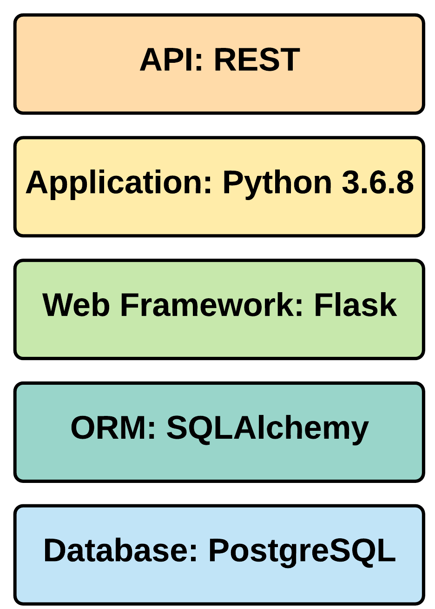
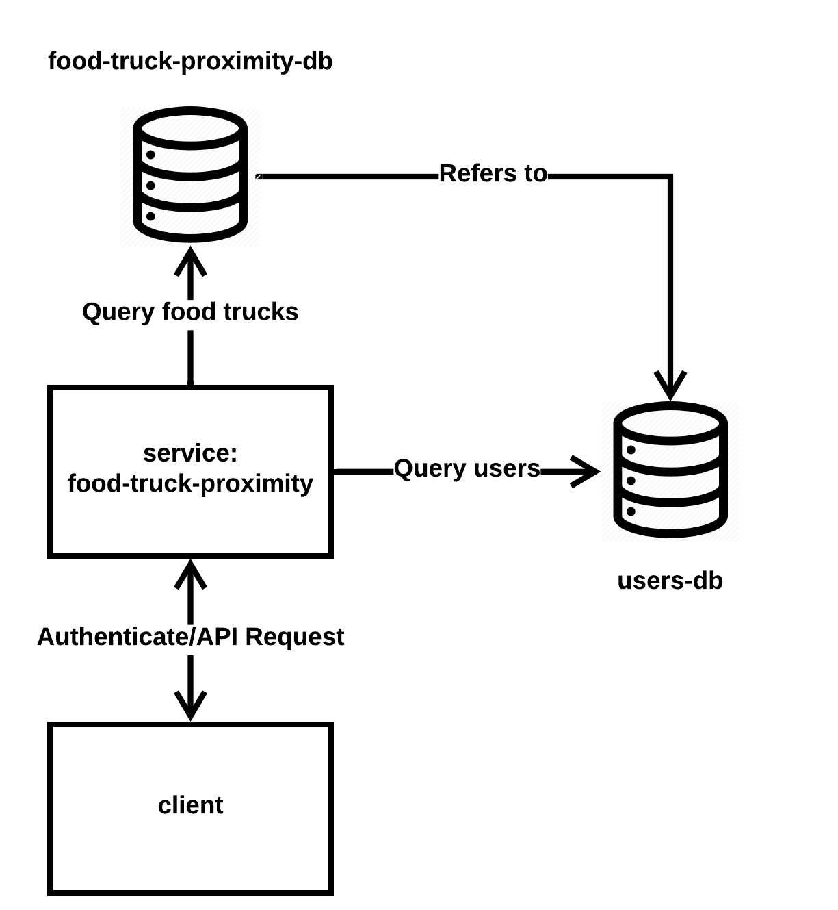
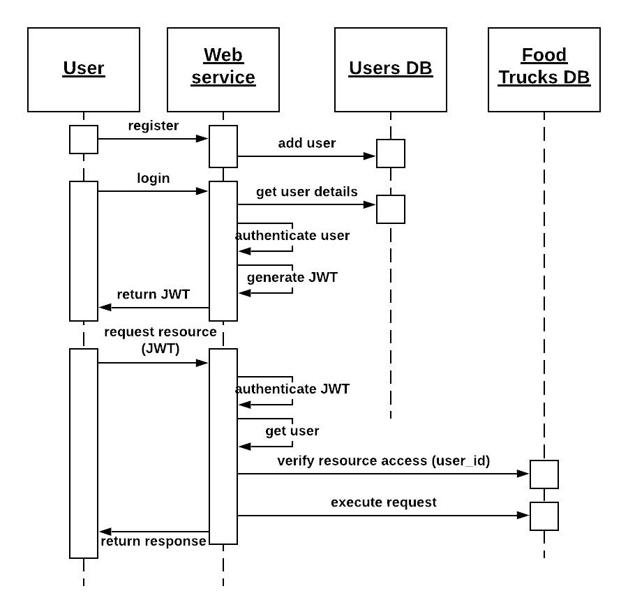
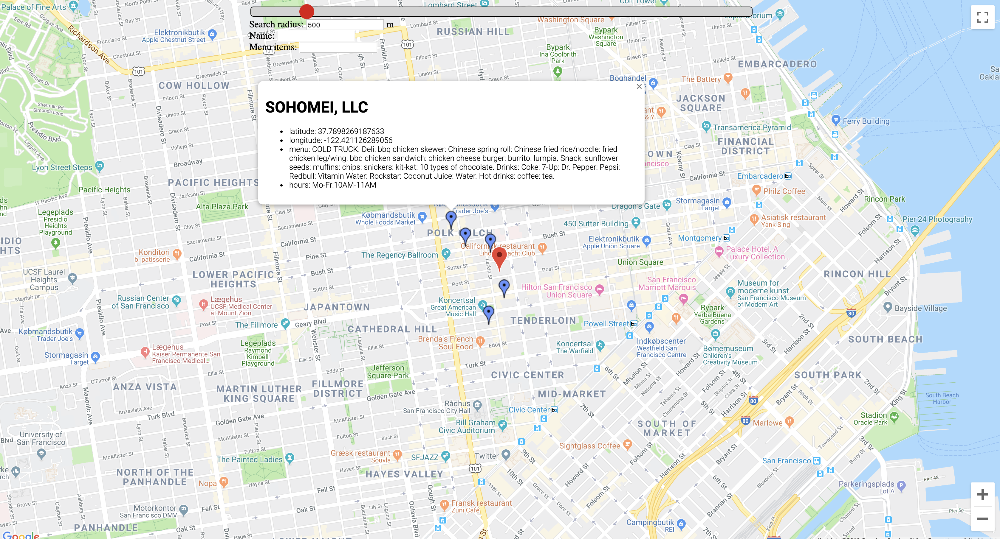
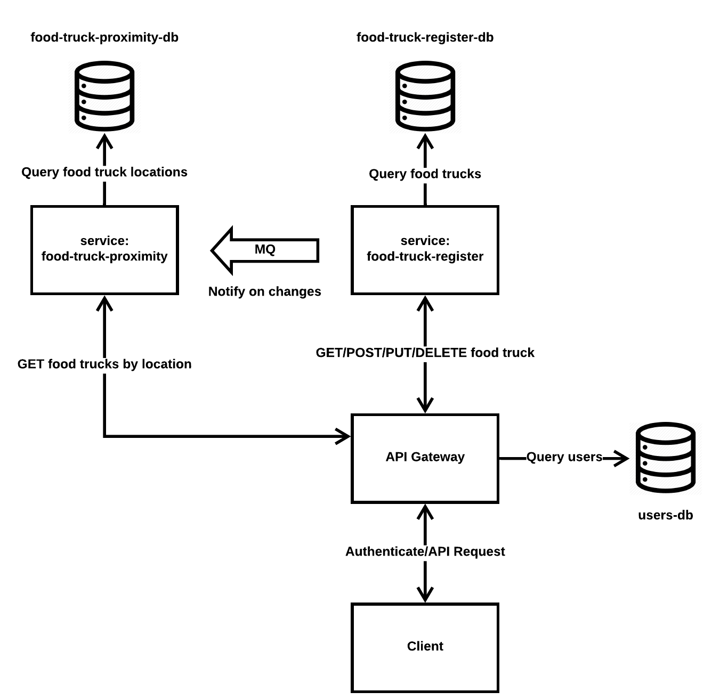

# food-truck-proximity
An application for locating food trucks in San Francisco based on the public [dataset](https://data.sfgov.org/Economy-and-Community/Mobile-Food-Facility-Permit/rqzj-sfat). The application is inspired by the [Uber coding challenge](https://github.com/uber-archive/coding-challenge-tools/blob/master/coding_challenge.md) and is used as a personal hobby project to explore various technologies.

The structure of the repository is as follows:
- [`application`](https://github.com/Woobs8/food-truck-proximity/tree/master/application): implementation of the web application
- [`docs`](https://github.com/Woobs8/food-truck-proximity/tree/master/docs): documents and images used for documentation
- [`migrations`](https://github.com/Woobs8/food-truck-proximity/tree/master/migrations): auto-generated directory used to manage database migrations
- [`tests`](https://github.com/Woobs8/food-truck-proximity/tree/master/tests): unit and integration tests
- [`utils`](https://github.com/Woobs8/food-truck-proximity/tree/master/utils): utility scripts used during development for convenience

The application is hosted on [Heroku](https://food-truck-proximity.herokuapp.com/).

## Table of Contents
1. Problem Description
2. Data Model
3. Application Design
4. Testing
5. Deployment
6. Omissions, Considerations and Future Work

## Problem Description
The service should allow a client to request food trucks that are nearby a specific location on a map. I imagine a usage scenario where clients in the form of mobile apps will utilize the service to query nearby food trucks. How the location is determined, how the distance is measured and what is considered 'nearby' is not specified, and is therefore considered a design choice. The distance can be calculated as the spherical distance between coordinates, which would not account for street layout and may therefore not represent the actual distance one would have to travel to reach the location. Alternatively, the distance can take street layout into account and measure distance as the travel distance along the shortest or fastest route. The former method is fairly straightforward, and can be computed using just the coordinates. The latter method requires up-to-date maps, and involves more complex computations that will likely involve external APIs. With the scope of the project and the envisioned usage scenario in mind, I decided that the spherical distance was the best choice, as it provides a good approximation of actual traval distance with minimal complexity, and does not rely on external APIs.

As this is the backend track, the service does not include a frontend, but exposes an API that clients, in the form of apps or services, can interact with. Since there is no frontend, no geolocalization of the client is done, and the client is expected to know its own location. The definition of 'nearby' is left up to the clients, as the API should provide clients with an option for specifying the radius within which food trucks should be located.

Given the above problem description, the API should expose the following functionality to the client:
* Lookup all food trucks
* Lookup a specific food truck
* Add a food truck
* Update a specific food truck
* Delete a specific food truck
* Lookup food trucks by name
* Lookup food trucks by their menu items
* Lookup food trucks by their proximity to a specific location
  * The location and search radius should be parameters for the lookup
  * The client should be able to filter the search by food truck name and/or menu items

## Data Model
The data model is based on the above requirements and the structure of the available data. The model contains the following fields:
1. uuid: unique identifier (primary key)
2. name: name of the truck
3. latitude: decimal latiude coordinate of the truck
4. longitude: decimal longitude coordinate of the truck
5. days_hours: string representation of the business hours of the truck
6. food_items: string representation of the truck's menu items

The data used for the service is based on mobile food facility permits in [San Francisco](https://data.sfgov.org/Economy-and-Community/Mobile-Food-Facility-Permit/rqzj-sfat).

All of these fields apart from the primary key exist in the original data in the same format. The remaining fields in the original data were not deemed relevant for the functionality of this service and were therefore omitted. An example of the resulting data model is shown in the table below:

| uuid   | name             | latitude | longitude | days_hours       | food_items              |
| :------| :----------------| :--------| :---------| :----------------| :-----------------------|
| 1      | Joe's Food Truck | 37.7201  | -122.3886 | Mon-Fri:8AM-2PM  | sandwiches: soft drinks |
| 2      | Bob's Food Truck | 37.7220  | -122.3830 | Tue-Fri:10AM-5PM | burgers: soft drinks    |

## Application Design
The application is written in Python because there are great and well documented frameworks available in Python, and because it is the language I am most comfortable writing in, which is also an important consideration given the time constraints of the project.

The overall architecture of the service is shown below:

    

The most important technologies used in the service are shown below:

    

### Database
The data model is designed for a relational database. I went with PostgreSQL because it is an open-source RDBMS that works well in production environments. Additionally, I had some previous experience working with PostgreSQL in the Heroku environment. Alternative RDBMS options such as MySQL would also be a valid option. Disk-based RDBMS options such as SQLite would simplify the local development and testing, but it is poorly supported in production environments, and was therefore not considered.

### ORM
An ORM is a useful abstraction layer to the database access that makes code portable between vendors, since vendor-specifc SQL is handled by the ORM. Most ORMs also provide increased security against attacks such as SQL injection, since they implement measures such as escaping input and prepared statements as a default. In my experience, SQLAlchemy is the most intuitive and feature-rich python ORM and also the default ORM of the Flask framework, which is used as the framework for the web application.

### Web Framework
Flask is a lightweight web framework for Python. I did not have any previous experience working with Flask, but initial research indicated that it was lightweight, intuitive and simple to configure. I figured this was ideal for a relatively simple application such as this, where heavier and more feature-rich frameworks such as Django are not necessary.

### Application
#### Architecture
The application is designed as a web application using the traditional Model-View-Controller architecture. The `models` directory contains the models of the application. Currently only a single model is used, which is implemented in the `food_trucks.py` module. This model defines the ORM model for a database of food trucks. The `blueprints` directory contains Flask blueprints, which are reusable views. The only blueprint currently used `error_handlers.py` defines views for generic error handlers. The `views` directory contains implementations of views for the API endpoints. All the views are implemented as subclasses of the Flask MethodView class, which automatically dispatches request methods to their corresponding class method. The directory is structed into subdirectories containing the API endpoints for the resource identified by the directory name. The service currently only has one resource - namely the `foodtrucks` resource. Common for all views is that since there is no frontend, the views are simply a JSON representation of requested resources.

The Flask application factory itself is defined in the `app_factory.py` module where the endpoints are registered. The flask extension libraries `flask-migrate` and `flask-script` are used to create a `manage.py` script for managing and performing database migrations. The ability to migrate the database is not required for the current application, but is a nice feature if one were to continue development of the application, and add features that would require database schema changes in the future.

#### Logging
The application currently logs all internal errors and database changes to files in two hour increments, storing up to 24 hours of logs. The increment and duration of the log is dependent on the load and frequency of maintenance of the service, and the chosen values are not necessarily optimal. GET requests and client errors such as bad requests are not logged, since they would clutter the log. The current approach requires admins to periodically access the server and read the log files to discover errors. A better solution would be to inform admins in case of errors through email or similar, but this was outside the scope of the project.

#### Finding Food Trucks in the Proximity of a Location
The client will send a GET request to the `foodtrucks/location` resource and include the mandatory parameters _latitude_ and _longitude_ specifying the location, and optionally a _radius_ parameter specifying the search radius.

The application then queries the database for the elements whose location, as given by their coordinates, is within _radius_ distance of the client location. The query uses the [haversine formula](https://en.wikipedia.org/wiki/Haversine_formula) to calculate the _great-circle distance_ between every element and the client location and returns those within the _radius_.

### API
I decided go with a RESTful approach to the API because it provides a  stateless interaction between the service and clients, which is an nice feature when the service is designed to be used by other services as it simplifies the interfaces. I also thought that a RESTful approach would provide an intuitive interface to the underlying resources.

Given the initial API requirements, the API has the following endpoints:

| Method    | Endpoint                     | Description                                          | Status Code |
| :---------| :----------------------------| :----------------------------------------------------| :-----------|
| GET       | `/`                          | Resource collection metadata                         | 200         |
| GET       | `/foodtrucks`                | List all food trucks                                 | 200         |
| POST      | `/foodtrucks`                | Add new food truck to resources                      | 201         |
| GET       | `/foodtrucks/{truck_id}`     | Get food truck details                               | 200         |
| PUT       | `/foodtrucks/{truck_id}`     | Update or create food truck                          | 200         |
| DELETE    | `/foodtrucks/{truck_id}`     | Remove food truck                                    | 200         |
| GET       | `/foodtrucks/name/{needle}`  | Get list of food trucks filtered by name             | 200         |
| GET       | `/foodtrucks/items/{needle}` | Get list of food trucks filtered by menu items       | 200         |
| GET       | `/foodtrucks/location`       | Get list of food trucks in the proximity of location | 200         |

The detailed API documentation is included in a [separate document](docs/api_documentation.pdf). The format is inspired by the documentation of the Uber [Riders API](https://developer.uber.com/docs/riders/references/api).

#### GraphQL
For experimental purposes, a GraphQL API has been added to the `/graphql` endpoint. The GraphQL api serves the `foodtrucks` resource, supports CRUD operations, and requires authentication for write operations. It does not currently support location-based filtering.

#### Authentication
The application uses a simple authentication scheme based on JSON web tokens (JWT) that protects the POST, PUT and DELETE API endpoints. The system works by having clients register themselves to the service using a _username_ and _password_. The user is then created and stored in a _Users_ database. After registration, a client will be able to request a JWT by logging in, which prompts the service to return a JWT on successful login. The client can then use the JWT to access the API. The JWT is only valid for a set duration, after which a new login is required. Since each issued JWT is associated with a user, the service can associate a request with a user when a JWT is included.

By adding a _user_ columns to the database of food trucks, and filling that column with the user id retrieved from the JWT in the POST or PUT request that created the entry, each entry is associated with the user that created it. The service is then be able to restrict POST/PUT/DELETE access to a given resource to a specific user.

The architecture of the authentication scheme is shown below, including a sequence diagram illustrating the proposed authentication procedure for a client:

    
    

## Testing
The test setup uses the `pytest` package, as it is the one recommended by the Flask [documentation](http://flask.pocoo.org/docs/1.0/testing/).

The test setup requires:
* Test PostgreSQL database server
* Local python 3.6.8 environment
* Python packages listed in `requirements.txt` must be installed

The tests are separated into two modules: `unit` and `functional`. The `unit` module contains unit tests for the application model. The `functional` module contains the integration tests for the Flask application and tests all the application endpoints. The test data used to test the application and model is stored in `test_data.py`, which also contains the expected return values for differerent test cases.

## Deployment
The service is deployed on Heroku at https://food-truck-proximity.herokuapp.com/ on a free web dyno with a hobby-dev PostgreSQL database service. The free dyno will sleep after 30 min of inactivity. A sleeping dyno will be woken by new requests, but require a slight delay while reactivating.

The database has been populated with the original data from the [API](https://data.sfgov.org/Economy-and-Community/Mobile-Food-Facility-Permit/rqzj-sfat). Only the entries with non-Null values in the included columns were used, limiting the dataset to 511 entries.

## Frontend Demo
Based on feedback, a simple frontend has been added to demonstrate how the service may be used by an end-user for locating nearby food trucks. The frontend is an interactive map based on the [Google Maps Javascript API](https://developers.google.com/maps/documentation/javascript/tutorial), where the client can select a location on the map, as well as the search radius, name and menu items to filter results by, and see any food trucks nearby that location. The food trucks are visualized on the map using markers, which the user can mouseover to get details about each truck. As this frontend intended as a PoC, and not as part of the service as such, the functionality has been the focus, and styling is kept at a minimum.

The frontend demo can be found at the endpoint [`/foodtrucks/location/map`](https://food-truck-proximity.herokuapp.com/foodtrucks/location/map).

    

## Future Work
### Database Optimization
More time should be dedicated to investigating optimization of the database queries. Currently, _haversine_ computations are performed for all elements in the database. A more efficient appraoch may be to assume a planar surface and do a simple range query on the _latitude_ and _longitude_. The output of this query can then be further filtered by the actual spherical distance using the _haversine_ function. This would reduce the number of _haversine_ distance computations, and may be more efficient, but this would have to be investigated further.

### Scalability
I have not addressed scalability explicitly in the design of the application, but I have considered some potential design improvements that would improve scalability.

#### Issue: How to Handle Expansion of Geographical Area
The original dataset is limited to San Francisco, but the service does not limit the food truck locations to just this area as clients can POST food trucks located anywhere in the world. If one were to consider expanding the service for worldwide adoption, using a single database table to store all trucks in the world is not a good idea, and a different approach is required.

##### Solution: Differerent Database Tables for Different Geographical Areas
A solution to this problem would be to split the overall geographical area of the countries in which the service is operating into smaller areas, and assign each of these to a table in the database. A location query would then first query the relevant table, and then the entries in that table. In the case of a location on the border of tables, the query would have to query the entries in all tables around that border.

#### Issue: Inefficient Location Queries
One of the primary inefficiencies in the current design of the service is the fact that every single location query calculates the distance to every entry in the database and returns those within a search radius. This is fine for a small dataset, but if the dataset were to grow significantly, the query may slow down. The location request can be expected to be the most commonly occurring, and improving its efficiency should therefore improve the scalability of the service.

Additionally, in the scenario where a large number of users are located in the same area, many nearly identical requests would be processed, with nearly identical results. In this scenario, the service might be able to conserve resources by reusing the results of previously processed requests.

##### Solution: Caching Location Queries
Adding a cache for requests would allow the service to reuse previously processed requests at a future time and thereby save computational resources. This works fine for the simple requests where there is no or little variation in the request parameters, but the location includes coordinates, which has a large set of possible values, and is therefore much more variable. The effectiveness of the caching is therefore limited. However, in the spirit of efficiency we might discretize the client coordinates further and round to the decimal place representing an arbitrary real world resolution. The result is that the service would consider all clients to be at their nearest _round-off point_, and serve all clients at each of these points the same results. This would improve the effectiveness of caching as the set of possible parameters is reduced. The obvious drawback, is that clients get less accurate results, but this may not be a problem as long as the rounding resolution is not too coarse. The resolution should be chosen according to the expected number of users and the precision desired for the user queries.

The cache of a given request would have to invalidated whenever its return result is affected by the addition, update or deletion of a food truck. This introduces an additional overhead on these operations, but with the assumption that GET requests outnumber POST, PUT and DELETE requests, the efficiency gains may outweigh the overhead and provide a net gain.

### Micro-Service Architecture
Initially, my approach was to imagine the service as a part of a larger system based on a micro-service architecture. The idea was motivated by wanting the system to be both scalable and extendable. In this system, the `food-truck-proximity` service would only be responsible for exposing an API for querying food trucks in proximity to a location while another service `food-truck-register` would expose an API for getting, adding, updating and deleting food trucks. The `food-truck-register` service would then notiy the `food-truck-proximity` service whenever changes occur, so it can update its database accordingly. New features can then be added to the system by adding additional services.

An API gateway would be used to mimic a monolithic application from the perspective of the client. The API gateway would also enforce the client authentication.

    

